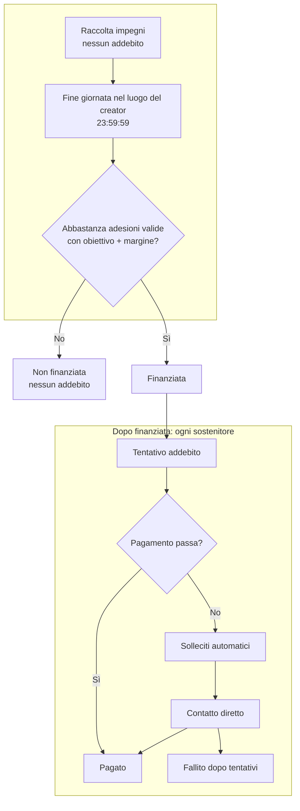

# Diagramma (Mermaid) — chiusura campagna

Utile in GitHub / Obsidian / editor che rendono Mermaid.  
Per una versione già disegnata e stampabile usa **`chiusura-campagna-leggibile.html`**.

```mermaid
flowchart TB
  subgraph raccolta[" "]
    R[Raccolta impegni\nnessun addebito]
    D[Fine giornata nel luogo del creator\n23:59:59]
    Q{Abbastanza adesioni valide\ncon obiettivo + margine?}
  end
  R --> D --> Q
  Q -->|No| NF[Non finanziata\nnessun addebito]
  Q -->|Sì| F[Finanziata]

  subgraph pagamenti["Dopo finanziata: ogni sostenitore"]
    T[Tentativo addebito]
    P{Pagamento passa?}
    OK[Pagato]
    SOL[Solleciti automatici]
    CD[Contatto diretto]
    FAIL[Fallito dopo tentativi]
  end
  F --> T --> P
  P -->|Sì| OK
  P -->|No| SOL --> CD
  CD --> OK
  CD --> FAIL
```
